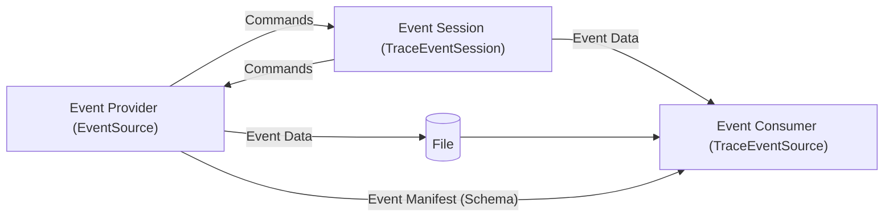

# ETW (Event Tracing for Windows)

## Guide

[guide](https://github.com/microsoft/perfview/blob/main/documentation/TraceEvent/TraceEventProgrammersGuide.md)

Event Tracing for Windows® (ETW) is a general-purpose, high-speed tracing facility provided by the operating system. Using a buffering and logging mechanism implemented in the kernel, ETW provides a tracing mechanism for events raised by both user-mode applications and kernel-mode device drivers. Additionally, ETW gives you the ability to enable and disable logging dynamically, making it easy to perform detailed tracing in production environments without requiring reboots or application restarts. The logging mechanism uses per-processor buffers that are written to disk by an asynchronous writer thread. This allows large-scale server applications to write events with minimum disturbance.

There are three basic parts to and ETW based logging system as shown in the figure below

1. The **Event Session** (represents the entity controlling the logging). The session has the ability to tell the providers of events to start and stop logging and control how verbose the logging is. It also has the ability to route the data to various places. It can indicate that the data should be directly written to a file (for maximum efficiency) or to send it to the session itself (for on the fly processing)
2. The **Event Provider** is the part of the logging system that is wired into the application to be monitored. Its job is to call a logging API when interesting things happen in the application.
3. The **Event Consumer** takes the data from the file or from the session and consumes it in some way, typically generating aggregate statistics and generating alerts.

Corresponding to each of these 'players', the TraceEvent library has a class that supports that role.

1. The **Event Session** uses the `Microsoft.Diagnostics.Tracing.TraceEventSession` class.
2. The **Event Provider** uses the `Microsoft.Diagnostics.Tracing.EventSource` class.
3. The **Event Consumer** uses the `Microsoft.Diagnostics.Tracing.TraceEventSource` class.

### Parsers

* `KernelTraceEventParser` - which knows about windows OS kernel events. These include DLL loading, process start, stop, CPU sampling, page faults, Disk I/O file I/O, memory, etc.
    * Process start/stop, Thread start/stop, DLL load and unload.
    * CPU Samples every MSec (but you can control the frequency down to .125 msec).
    * Every context switch (which means you know where you spend blocked item) as well as the thread that unblocked the thread.
    * Page faults.
    * Virtual memory allocation.
    * C or C++ heap allocations.
    * Disk I/O.
    * File I/O (whether it hits the disk or not).
    * Registry access.
    * Network I/O.
    * Every packet (with compete data) that comes on or off the network (network sniffer).
    * Every system call.
    * Sampling of processor CPU counters (instructions executed, branch mispredicts, cache misses, ...) (Windows 8 only).
    * Remote procedure calls.
    * How the machine is configured (disk, memory, CPUs, ...).
* `ClrTraceEventParser` - which knows about Common Languages Runtime (.NET CLR) events. These include GC events, Just in Time compilation events, Exception events, ...
    * When GCs happen.
    * When allocations are made (sampling and non-sampling).
    * When objects are moved during a GC.
    * When methods are Just In Time (JIT) compiled.
    * When exceptions are thrown and the stack at which it was thrown.
    * When `System.Threading.Task.Task` instances are created and scheduled.
    * Addition information on why a .NET assembly failed to load (to diagnose failures).
    * Information to decode .NET frames in stack traces.
* `DynamicTraceEventParser` - which knows about any event provider that have 'dynamic' manifests, in the sense that manifest information is dumped into the event stream using a standard convention. All `EventSource` types follow this convention, and thus all EventSources can be parsed by this parser.
* `RegisteredTraceEventParser` - which knows about any event provider that registers itself with the operating system (using the **wevtutil** command)). This includes most providers that ship with the Windows operating system that are NOT the kernel provider or `EventSource` sources. You can see a list of such providers with the `logman query providers` command.
* `WPPTraceEventParser` - which knows how to parse events written with the [WPP Tracing](http://msdn.microsoft.com/en-us/library/windows/hardware/ff556204.aspx) system. Device drivers and other low-level components often use this mechanism.
* `JScriptTraceEventParser` - which knows about the JavaScript runtime events
* `TPLTraceEventParser` - which knows about the Task Parallel Library (another name for classes in the `System.Threading.Tasks` namespace).
* `ASPNetTraceEventParser` - which knows about ASP.NET events.

### Limitations

Unfortunately, there are some limitations in ETW that sometimes block it from being used in scenarios where it would otherwise be a natural fit. They are listed here for emphasis.

* You send commands to providers on a machine wide basis. Thus you can't target particular processes (however if you own the event provider code you can pass it extra information as arguments to 'enable' command to the provider and have your provider implement logic to ignore 'enable' commands not intended for it). (Fixed in Windows 8.1).
* Because commands are machine wide and thus give you access to all information on the system, you have to be Elevated (Admin) to turn an ETW session on or off.
* By design the communication between the controllers and the providers is 'fire and forget'. Thus ETW is not intended to be a general purpose cross process communication mechanism. Don't try to use it as such.
* In real time mode, events are buffered and there is at least a second or so delay (typically 3 sec) between the firing of the event and the reception by the session (to allow events to be delivered in efficient clumps of many events).
* Before Windows 8, there could only one kernel session. Thus using kernel mode events for 'monitoring' scenarios was problematic because any other tools that used kernel sessions were likely to interfere by overriding the single Kernel model event logging session.
* In general scenarios having multiple controllers (sessions) controlling the same providers is dangerous. It can be done in some cases, but there is a significant potential for interference between the sessions.
* The file format is private, and before Windows 8 could be quite space inefficient (it compresses 8-to-1). Files can get big fast.
* Logging more than 10K events/sec will load the system noticeably (5%). Logging more frequently than 10K/sec should be avoided if possible. Logging 1M events/sec will completely swamp a typical machine.
